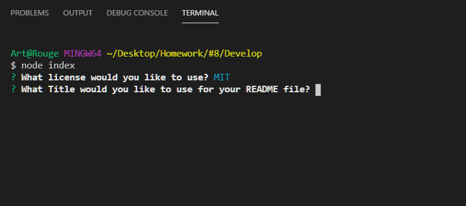
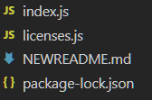

# Readme-generator  


# Description
The main scope of this project is to create a readme generator that simpifies making a readme file

# User Story
AS A student
I WANT a way to simplify making a Readme.md file
SO THAT I can streamline my projects

## Table of Contents
* [Acceptance Criteria](#Acceptance)
* [Technology](#Technology)
* [Installation](#Installation)
* [Usage](#Usage)
* [Credits](#Credits)
* [License](#License)
* [Review](#Review)


## Acceptance Criteria

```
GIVEN a command-line application that accepts user input
WHEN I am prompted for information about my application repository
THEN a high-quality, professional README.md is generated with the title of my project and sections entitled Description, Table of Contents, Installation, Usage, License, Contributing, Tests, and Questions
WHEN I enter my project title
THEN this is displayed as the title of the README
WHEN I enter a description, installation instructions, usage information, contribution guidelines, and test instructions
THEN this information is added to the sections of the README entitled Description, Installation, Usage, Contributing, and Tests
WHEN I choose a license for my application from a list of options
THEN a badge for that license is added near the top of the README and a notice is added to the section of the README entitled License that explains which license the application is covered under
WHEN I enter my GitHub username
THEN this is added to the section of the README entitled Questions, with a link to my GitHub profile
WHEN I enter my email address
THEN this is added to the section of the README entitled Questions, with instructions on how to reach me with additional questions
WHEN I click on the links in the Table of Contents
THEN I am taken to the corresponding section of the README
```

## Technology

**HTML**
<br>
**CSS**
<br>
**JS**
<br>
**NODE.js**

## Installation

To install this program 
1-download the files from the git repository
2-open the folder containing the files in VS Code
3-right click on any file in the folder and select: "Open in Integrated Terminal"
4-type npm i to install all the necessary dependencies
5-run the proogram by typing node index.js

<br>
<br>

## Usage

When you run the program you will be presented with a series of questions


Simply fill out the information and the README.md file will be created in your current folder at the end of the prompts


I couldn't figure out how to make a video of this


<Br>
<Br>

## Credits

https://www.w3schools.com/default.asp
https://stackoverflow.com/
https://www.reddit.com/

<Br>
<Br>


## License
MIT License

Copyright (c) [year] [fullname]

Permission is hereby granted, free of charge, to any person obtaining a copy
of this software and associated documentation files (the "Software"), to deal
in the Software without restriction, including without limitation the rights
to use, copy, modify, merge, publish, distribute, sublicense, and/or sell
copies of the Software, and to permit persons to whom the Software is
furnished to do so, subject to the following conditions:

The above copyright notice and this permission notice shall be included in all
copies or substantial portions of the Software.

THE SOFTWARE IS PROVIDED "AS IS", WITHOUT WARRANTY OF ANY KIND, EXPRESS OR
IMPLIED, INCLUDING BUT NOT LIMITED TO THE WARRANTIES OF MERCHANTABILITY,
FITNESS FOR A PARTICULAR PURPOSE AND NONINFRINGEMENT. IN NO EVENT SHALL THE
AUTHORS OR COPYRIGHT HOLDERS BE LIABLE FOR ANY CLAIM, DAMAGES OR OTHER
LIABILITY, WHETHER IN AN ACTION OF CONTRACT, TORT OR OTHERWISE, ARISING FROM,
OUT OF OR IN CONNECTION WITH THE SOFTWARE OR THE USE OR OTHER DEALINGS IN THE
SOFTWARE.

<br><br>

## Review

### Live url: https://jtrejox.github.io/day-Scheduler/
### GitHub url: https://github.com/jtrejox/day-Scheduler

